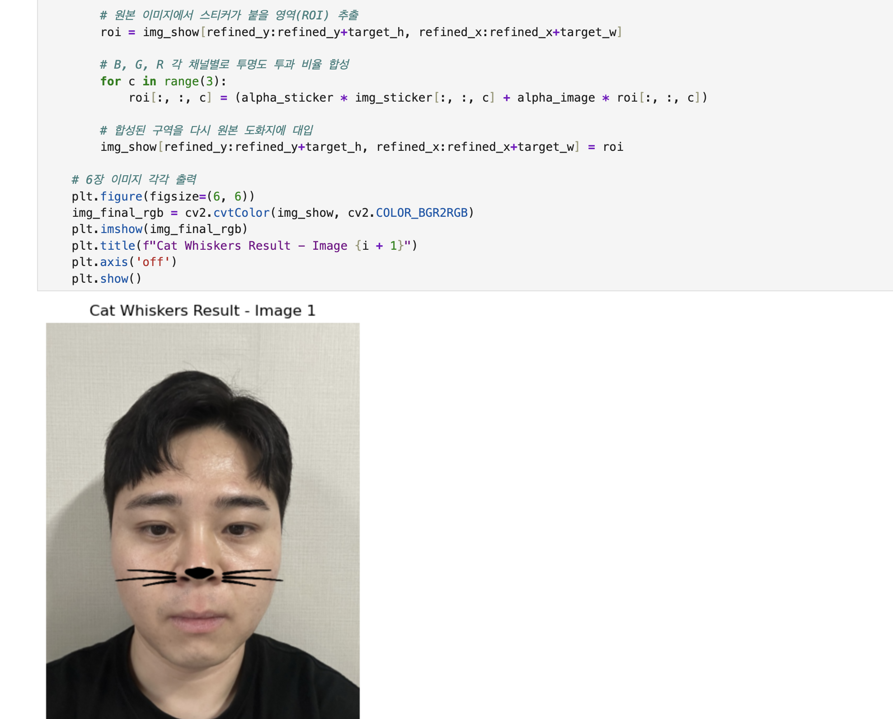
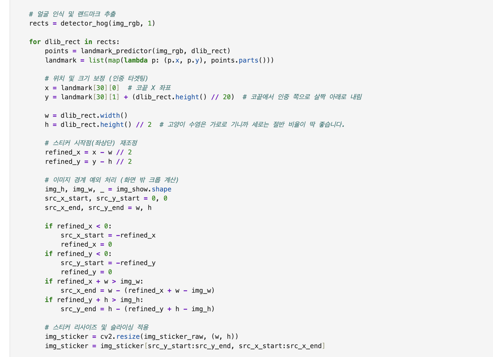

# AIFFEL Campus Online Code Peer Review Templete
- 코더 : 서한호
- 리뷰어 : 강경수


# PRT(Peer Review Template)
- [x]  **1. 주어진 문제를 해결하는 완성된 코드가 제출되었나요?**
    - 문제에서 요구하는 최종 결과물이 첨부되었는지 확인
        - 중요! 해당 조건을 만족하는 부분을 캡쳐해 근거로 첨부

> ## 알파 채널 합성까지 전 과정이 동작하고, 6장의 본인 사진에 고양이 수염이 적용된 최종 결과가 모두 출력되어 있습니다
    
- [x]  **2. 전체 코드에서 가장 핵심적이거나 가장 복잡하고 이해하기 어려운 부분에 작성된 
주석 또는 doc string을 보고 해당 코드가 잘 이해되었나요?**
    - 해당 코드 블럭을 왜 핵심적이라고 생각하는지 확인
    - 해당 코드 블럭에 doc string/annotation이 달려 있는지 확인
    - 해당 코드의 기능, 존재 이유, 작동 원리 등을 기술했는지 확인
    - 주석을 보고 코드 이해가 잘 되었는지 확인
        - 중요! 잘 작성되었다고 생각되는 부분을 캡쳐해 근거로 첨부

> ## "화면 밖 크롭 계산", "B,G,R 각 채널별 투명도 비율 합성" 같은 주석이 줄마다 달려 있어 따라가기 쉬웠습니다.
        
- [ ]  **3. 에러가 난 부분을 디버깅하여 문제를 해결한 기록을 남겼거나
새로운 시도 또는 추가 실험을 수행해봤나요?**
    - 문제 원인 및 해결 과정을 잘 기록하였는지 확인
    - 프로젝트 평가 기준에 더해 추가적으로 수행한 나만의 시도, 
    실험이 기록되어 있는지 확인
        - 중요! 잘 작성되었다고 생각되는 부분을 캡쳐해 근거로 첨부
> ## 본인 사진을 6장을 직접 촬영해서 적용한 점, 그리고 측면 사진에서 검출 박스가 얼굴을 다 못 감싸거나 수염이 어긋나는 결과까지 그대로 보여준 점이 좋았습니다만 그 결과에 대한 분석/원인 기록이 텍스트로는 거의 없어서, "측면에서 왜 어긋나는지" 한 줄씩만 있었으면 더 좋았겠습니다.
        
- [ ]  **4. 회고를 잘 작성했나요?**
    - 주어진 문제를 해결하는 완성된 코드 내지 프로젝트 결과물에 대해
    배운점과 아쉬운점, 느낀점 등이 기록되어 있는지 확인
    - 전체 코드 실행 플로우를 그래프로 그려서 이해를 돕고 있는지 확인
        - 중요! 잘 작성되었다고 생각되는 부분을 캡쳐해 근거로 첨부
> ## 별도의 회고 텍스트는 보이지 않습니다.
        
- [x]  **5. 코드가 간결하고 효율적인가요?**
    - 파이썬 스타일 가이드 (PEP8) 를 준수하였는지 확인
    - 코드 중복을 최소화하고 범용적으로 사용할 수 있도록 함수화/모듈화했는지 확인
        - 중요! 잘 작성되었다고 생각되는 부분을 캡쳐해 근거로 첨부
> ## 이미지를 리스트(bgr_images)에 담아 반복문으로 처리하여 (In [93], In [94]) 코드가 간결해졌습니다.


# 회고(참고 링크 및 코드 개선)
```
# 리뷰어의 회고를 작성합니다.
# 코드 리뷰 시 참고한 링크가 있다면 링크와 간략한 설명을 첨부합니다.
# 코드 리뷰를 통해 개선한 코드가 있다면 코드와 간략한 설명을 첨부합니다.
```  
> ## 본인 사진을 정면·기울임·측면까지 직접 촬영해 적용한 점이 인상적이었고, 특히 스티커가 화면 밖으로 나갈 때 네 방향 경계를 각각 처리한 부분과 알파 채널 합성 구현이 꼼꼼했습니다. 다만 앞부분의 변수 6개 복붙 구간을 리스트+반복문으로 묶으면 코드가 훨씬 간결해질 것 같고, 측면에서 검출이 어긋나는 결과에 대한 짧은 분석과 회고가 더해지면 완성도가 높아질 것 같습니다.
