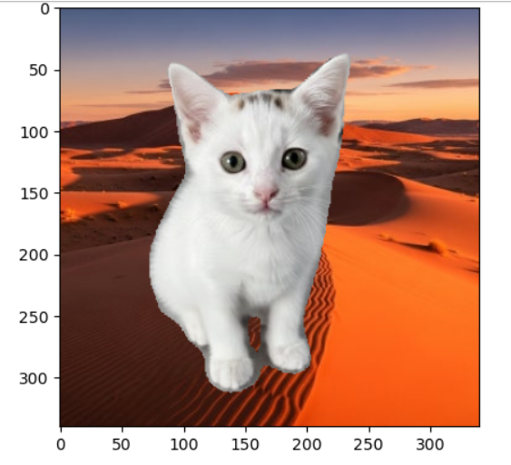
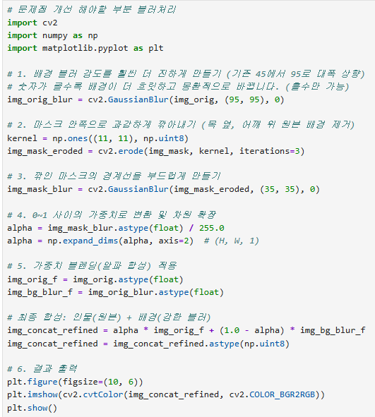
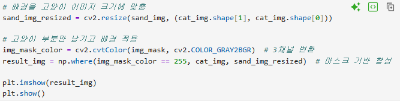
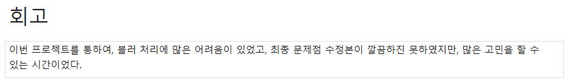
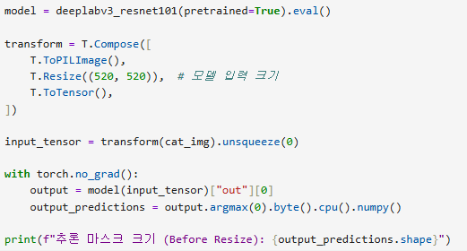

# AIFFEL Campus Online Code Peer Review Templete
- 코더 : 서한호
- 리뷰어 : 천세문


# PRT(Peer Review Template)
- [x]  **1. 주어진 문제를 해결하는 완성된 코드가 제출되었나요?**

      

    > 결과 잘 출력되었음

- [x]  **2. 전체 코드에서 가장 핵심적이거나 가장 복잡하고 이해하기 어려운 부분에 작성된 
주석 또는 doc string을 보고 해당 코드가 잘 이해되었나요?**

      

    > 각 코드의 주석을 통해 이해가 쉬움
       
- [x]  **3. 에러가 난 부분을 디버깅하여 문제를 해결한 기록을 남겼거나
새로운 시도 또는 추가 실험을 수행해봤나요?**

      

    > 데이터 구조를 고려하여 잘 가공하고 입력하였음

- [x]  **4. 회고를 잘 작성했나요?**

      

- [x]  **5. 코드가 간결하고 효율적인가요?**

      

# 회고(참고 링크 및 코드 개선)
```
이 프로젝트는 실제 사진들의 블러처리 기반 구조를 이해할 수 있었다.  
```
