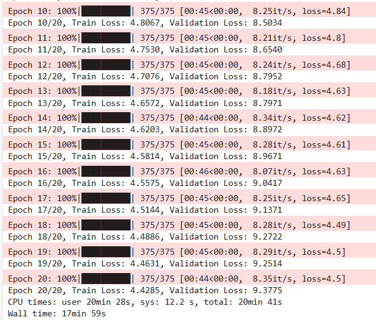
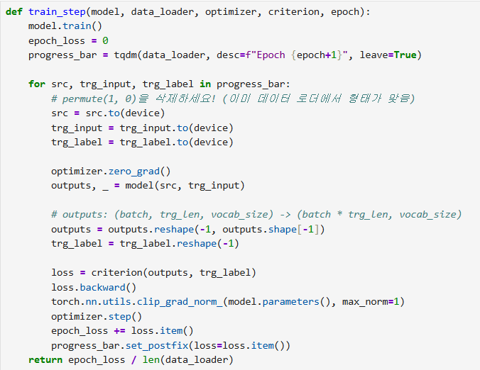
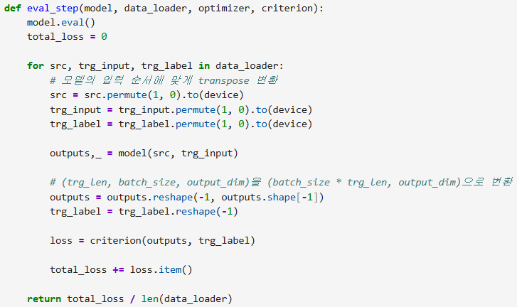
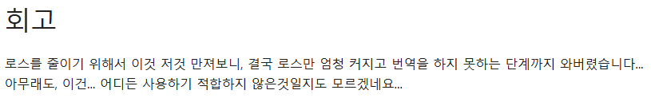
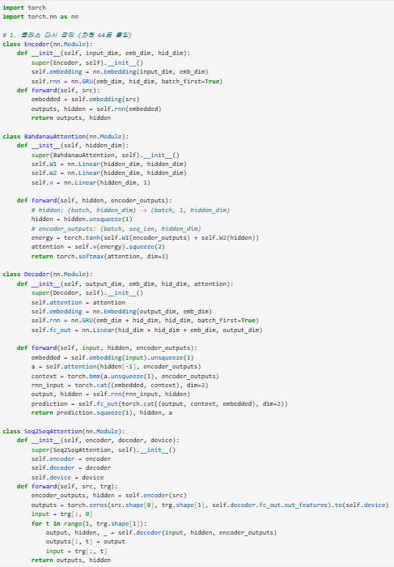

# AIFFEL Campus Online Code Peer Review Templete
- 코더 : 서한호
- 리뷰어 : 천세문


# PRT(Peer Review Template)
- [x]  **1. 주어진 문제를 해결하는 완성된 코드가 제출되었나요?**

      

    > 해당 프로젝트의 결과가 나왔음  
    
- [x]  **2. 전체 코드에서 가장 핵심적이거나 가장 복잡하고 이해하기 어려운 부분에 작성된 
주석 또는 doc string을 보고 해당 코드가 잘 이해되었나요?**

      

    > evaluate 평가 단계의 함수 정의 잘 정의하였음  
        
- [x]  **3. 에러가 난 부분을 디버깅하여 문제를 해결한 기록을 남겼거나
새로운 시도 또는 추가 실험을 수행해봤나요?**

      

    > batch_size, trg_len, output_dim 에 대한 코드 변환하여 문제를 해결하였음  
        
- [x]  **4. 회고를 잘 작성했나요?**

      

        
- [x]  **5. 코드가 간결하고 효율적인가요?**

      

    > 코드 길이 가장 긴 부분입니다. class 함수 정의를 잘 수행하였음을 볼 수 있음  

# 회고(참고 링크 및 코드 개선)
```
번역 결과에서 loss 값이 epoch 반복 실행마다 점점 높아지는 것을 볼 수 있다.  

이유를 찾아보니 학습 단계와 검증 단계에서 모델에 들어가는 입력 데이터의 형태가 다르기 때문이다.  

즉, 데이터 차원의 불일치로 인해 데이터 로더에서 나온 형태 그대로 학습 진행이 되었으며 평가 단계에서 배치 사이즈와 시퀀스 길이의 차원을 뒤집어벼렸기에 loss 값이 점점 높아졌을 것이다.
```
