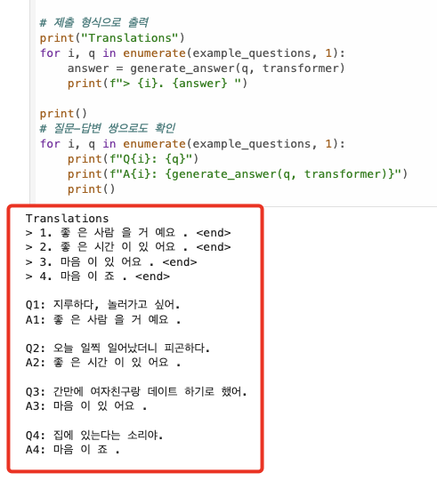
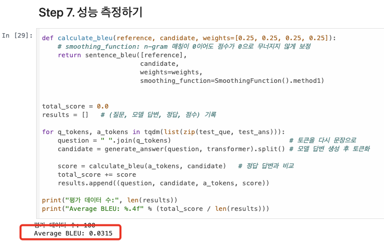
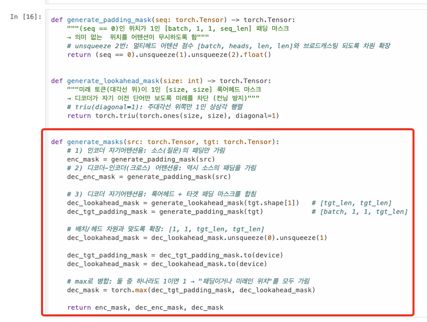
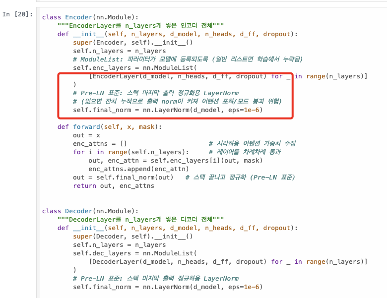
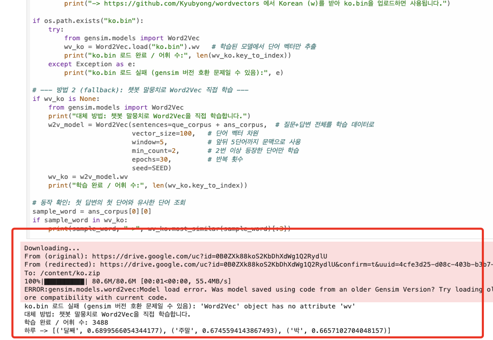
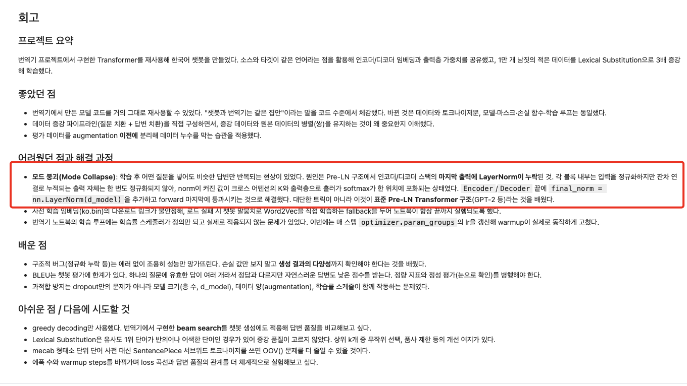
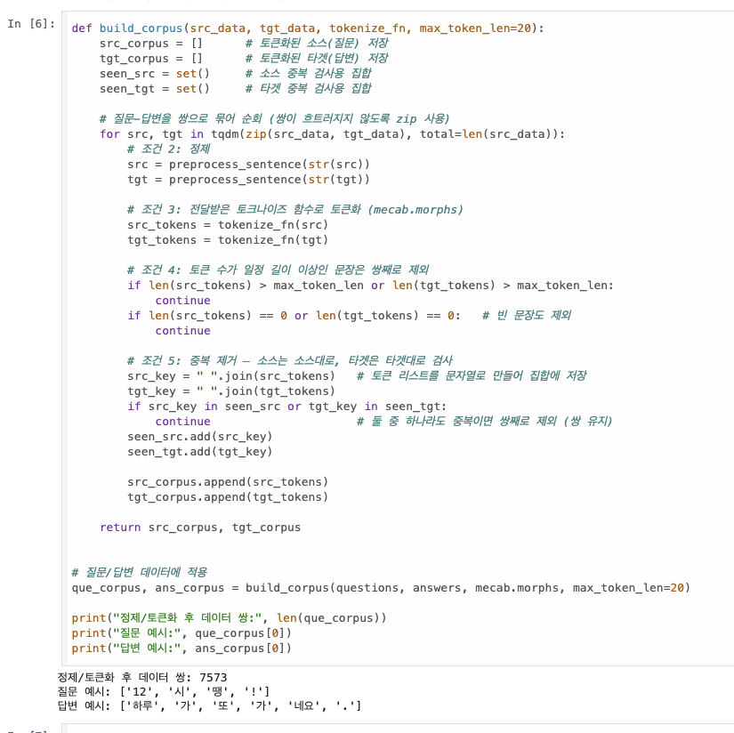

# AIFFEL Campus Online Code Peer Review Templete
- 코더 : 서한호 님
- 리뷰어 : 김민욱


# PRT(Peer Review Template)
- [x]  **1. 주어진 문제를 해결하는 완성된 코드가 제출되었나요?**
    - Step 1(데이터 다운로드)부터 Step 7(성능 측정)까지 빠진 단계 없이 이어지고, 모든 셀에 실행 결과가 남아 있어서 읽는 사람이 흐름을 그대로 따라갈 수 있었습니다.  
    - 루브릭 3번인 예문 4개 답변이 출력으로 그대로 남아 있어서 최종 결과물이 확실하게 보였어요.  
      
    - 루브릭 1번(증강)도 원본 7,473쌍 -> 22,393쌍(약 3배)으로 채우셨고, 질문 치환분과 답변 치환분을 나눠 붙이신 게 코드에 그대로 보입니다.  
    - 거기에 더해 Step 7에서 평가용 100쌍에 Average BLEU 0.0315까지 숫자로 재두셨어요. 저도 이번에 BLEU를 재봤는데(val 591쌍, corpus BLEU 4.13) 챗봇에서는 지표가 원래 박하게 나오더라고요. 회고에 적으신 "BLEU는 챗봇 평가에 한계가 있다"는 말에 완전히 공감했습니다.  
      

- [x]  **2. 전체 코드에서 가장 핵심적이거나 가장 복잡하고 이해하기 어려운 부분에 작성된 주석 또는 doc string을 보고 해당 코드가 잘 이해되었나요?**
    - 저는 이 프로젝트에서 마스크가 제일 어려웠는데, `generate_masks`에 세 종류 마스크를 왜 만드는지(인코더 자기어텐션 / 크로스 어텐션 / 디코더 자기어텐션) 번호를 붙여 적어주셔서 한눈에 정리가 됐습니다.  
    - 특히 `generate_padding_mask`의 "unsqueeze 2번: 멀티헤드 어텐션 점수 [batch, heads, len, len]와 브로드캐스팅 되도록 차원 확장" 이 한 줄이 좋았어요. 패딩은 "보이는 쪽(열)"만의 문제라 한 줄로 만들어두면 브로드캐스팅이 모든 행에 복사해준다는 게 이 주석 덕에 딱 정리됐습니다.  
    - 두 마스크를 `torch.max`로 합치면서 "둘 중 하나라도 1이면 1 -> 패딩이거나 미래인 위치를 모두 가림"이라고 적어주신 부분이 특히 좋았어요. 0과 1만 있는 표에서 원소별 최대값이 왜 "하나라도 가리자면 가린다"가 되는지, 저는 손으로 표를 그려보고서야 이해했는데 이 한 줄에 다 들어 있었습니다.  
      
    - 이어지는 어텐션 셀(In [17])의 `scaled_qk + (mask * -1e9)` 위에도 "마스크가 1인 위치에 -10억을 더해 softmax 후 확률이 0에 수렴하게 함"이라고 적어두셔서, 마스킹이 결국 softmax 앞에서 점수를 깎는 일이라는 게 말로 풀려 있었습니다. 저는 "1이 가린다"는 규약이 구현마다 반대라 한참 헤맸는데, 한호님 코드는 규약이 주석에 그대로 드러나 있어서 헷갈릴 일이 없어 보였어요.  

- [x]  **3. 에러가 난 부분을 디버깅하여 문제를 해결한 기록을 남겼거나 새로운 시도 또는 추가 실험을 수행해봤나요?**
    - 제일 인상 깊었던 부분입니다. 모드 붕괴(어떤 질문에도 비슷한 답만 나오는 현상)를 그냥 넘기지 않고, Pre-LN 구조에서 인코더/디코더 스택 **마지막 출력의 LayerNorm이 빠진 것**을 원인으로 짚어 `final_norm`을 넣어 고치셨네요. 저도 같은 자리를 고쳤는데 저는 퍼실님이 짚어주셔서 알았고, 한호님은 증상에서 출발해 원인까지 스스로 도달하신 거라 훨씬 값진 것 같습니다. 코드에 근거 주석까지 남기신 것도 좋았어요.  
      
    - 사전 학습 임베딩 `ko.bin`이 gensim 버전 문제로 로드에 실패하자, 그 자리에서 챗봇 말뭉치로 Word2Vec을 직접 학습하는 fallback을 두신 점이 실용적이었습니다. 실패 로그(`Model load error...`)를 지우지 않고 그대로 남겨두셔서, 무슨 일이 있었고 어떻게 우회했는지가 출력만 봐도 보였어요. 저는 같은 임베딩을 쓰려고 파일 포맷을 변환하느라 시간을 썼는데, "노트북이 언제 돌려도 끝까지 간다"는 관점에서는 한호님 방식이 더 나은 선택이었다고 생각합니다.  
      
    - 평가용 100쌍을 augmentation **이전에** 떼어내 누수를 막으신 것, 학습 루프에서 매 스텝 `optimizer.param_groups`의 lr을 갱신해 정의만 돼 있던 warmup 스케줄러가 실제로 동작하게 고치신 것까지, 노드 코드를 그냥 믿지 않고 검증하신 흔적이 여러 군데 보였습니다.  

- [x]  **4. 회고를 잘 작성했나요?**
    - 요약 / 좋았던 점 / 어려웠던 점과 해결 과정 / 배운 점 / 아쉬운 점으로 나눠 적어주셔서 읽기 좋았습니다.  
    - "구조적 버그는 에러 없이 조용히 성능만 망가뜨린다. 손실 값만 보지 말고 생성 결과의 다양성까지 확인해야 한다"는 문장이 특히 와닿았어요. 저도 이번에 "돌아가는 것과 맞는 것은 다르다"를 크게 배워서, 반가운 마음으로 읽었습니다.  
    - 다음에 시도할 것으로 beam search, 상위 k개 중 무작위 선택, 품사 제한, SentencePiece까지 구체적으로 적어두신 것도 좋았습니다. 막연한 "더 잘하고 싶다"가 아니라 뭘 할지가 이미 정해져 있어서요.  
      

- [x]  **5. 코드가 간결하고 효율적인가요?**
    - `build_corpus(src_data, tgt_data, tokenize_fn, max_token_len=20)`처럼 토크나이저를 인자로 받게 만드셔서, 나중에 mecab 말고 다른 토크나이저를 넣어도 그대로 쓸 수 있게 한 게 좋았습니다.  
    - 정제 -> 토큰화 -> 길이 필터 -> 중복 제거를 함수 하나에 순서대로 모아두고, 중복도 질문/답변을 각각 검사하되 걸리면 **쌍째로** 버려 병렬을 유지하신 게 깔끔했어요. 증강할 때도 `list(q)`로 복사해 원본을 안 건드리신 것까지 꼼꼼했습니다.  
    - `pad_sequences_custom`, `tokens_to_ids`, `loss_function`처럼 반복되는 일을 함수로 빼두셔서 학습 루프 본문이 짧게 읽혔고, 모델도 MultiHeadAttention / PoswiseFeedForwardNet / EncoderLayer / DecoderLayer / Encoder / Decoder / Transformer로 역할별 클래스가 잘 나뉘어 있었습니다.  
      


# 회고(참고 링크 및 코드 개선)
```
[리뷰어 회고]
같은 노드를 하면서 저도 헤맸던 자리를 한호님이 어떻게 넘으셨는지 보는 게 재밌었습니다.
특히 모드 붕괴를 증상에서 시작해 "스택 끝 LayerNorm 누락"까지 스스로 좁혀 들어가신 게
대단했어요. 저는 퍼실님이 짚어줘서 알았는데, 알고 나서도 왜 그런지가 이해가 안 돼서
따로 재봐야 했거든요.

그때 재본 걸 하나 공유드립니다. 저는 "잔차가 누적돼서 값이 폭주한다"고 배웠는데,
학습 전 랜덤 초기화(d_model 512, 2층)에서 실제로 std를 찍어보니 이랬습니다.

  임베딩 직후 std   22.637
  1번 레이어 후     22.639
  2번 레이어 후     22.642      <- 잔차 누적은 거의 없다
  final_norm 후      1.000

잔차는 거의 안 늘고, 임베딩에 곱하는 sqrt(d_model) = sqrt(512) = 22.6 이
Pre-LN에서 한 번도 정규화되지 않은 채 스택 끝까지 살아 나가는 게 더 커 보였습니다.
어텐션 logit std도 13.13 / 0.58 = 22.6 배로 딱 그 배수였어요.
결론(final_norm 추가)은 한호님과 같은데 원인 쪽이 조금 달라서 재미있어 적어봅니다.
제 실측도 2층/학습 전 기준이라 층이 깊어지면 또 다를 수 있습니다.

그리고 이게 1에폭 Loss 127.4와도 이어지는 것 같아요.
사전이 6,179개면 아무것도 모르는 상태의 손실은 ln(6179) = 약 8.7이어야 하는데 127이라
처음엔 놀랐는데, 제 노트북도 1에폭 loss가 119.4였습니다. 임베딩에 22.6을 곱해두고
출력층까지 그 임베딩을 공유(shared_fc)하니 초기 logit이 크게 나와서 그런 것 같습니다.
둘 다 2에폭에 10점대로 떨어지고 정상 궤도를 타는 걸 보면, 이 구조의 출발점인 듯해요.
같은 숫자를 보고 저도 한참 들여다봤던 터라 반가웠습니다.

주석이 줄마다 친절해서 코드를 처음부터 끝까지 읽는 데 부담이 없었고,
노드 코드를 그대로 믿지 않고 하나씩 확인하신 흔적이 곳곳에 보여서 배울 점이 많았습니다.
고생 많으셨어요!
```
