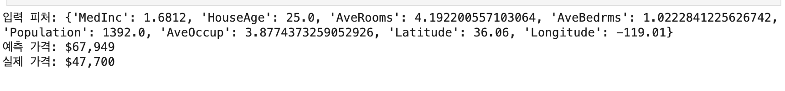
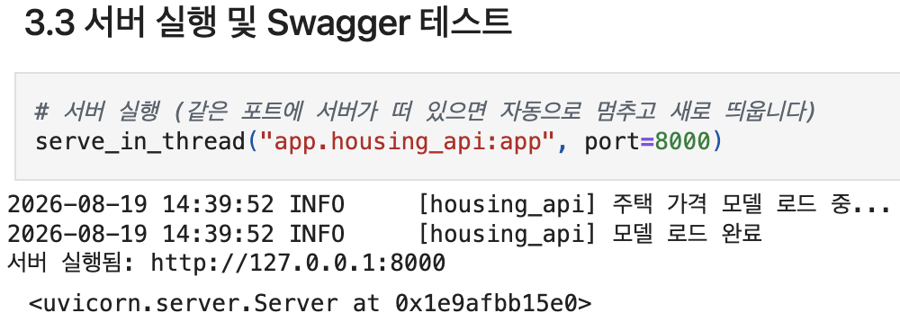
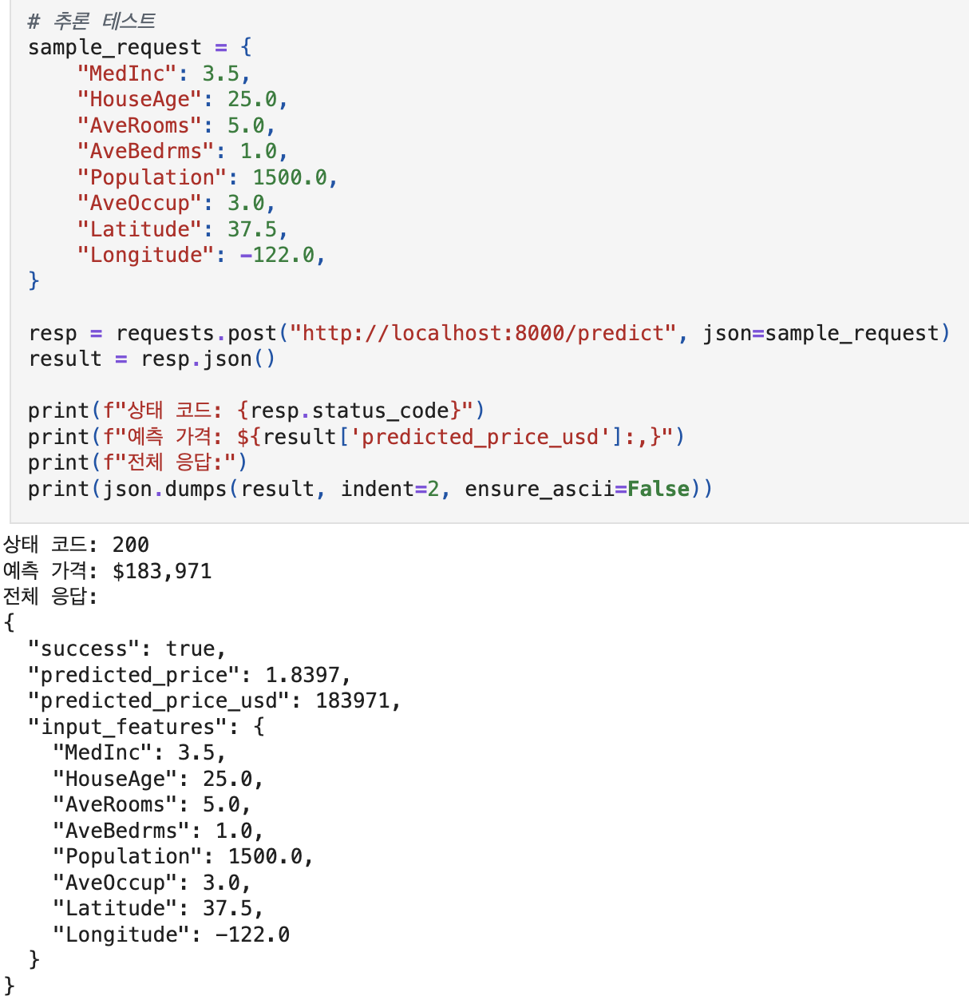
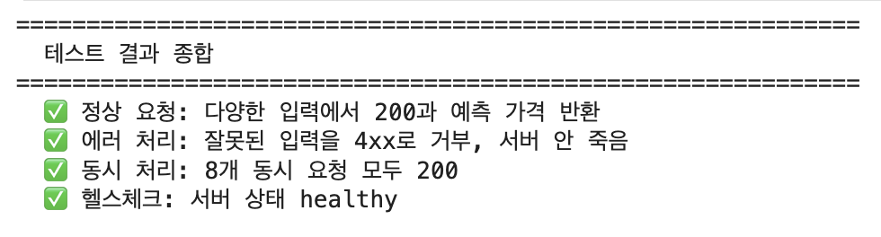
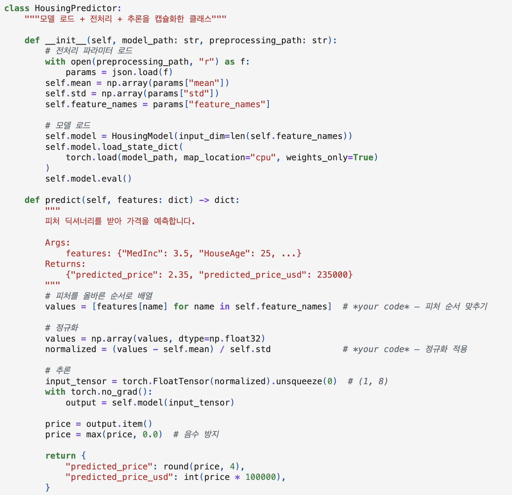
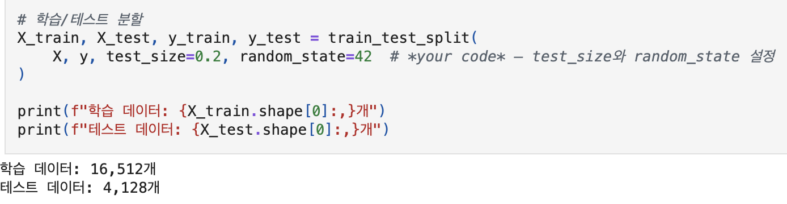

# AIFFEL Campus Online Code Peer Review Templete
- 코더 : 서한호
- 리뷰어 : 이다겸

# PRT(Peer Review Template)
- [x]  **1. 주어진 문제를 해결하는 완성된 코드가 제출되었나요?**

데이터 전처리부터 모델 학습 및 저장, FastAPI 기반 백엔드 API 구축, Streamlit 프론트엔드 연동, 그리고 최종 통합 테스트까지 전체 파이프라인을 다루는 완성된 코드가 정상적으로 실행 및 제출되었습니다.  

+ 모델 준비: 학습 → 전처리 파이프라인 → 저장
   

+ FastAPI 백엔드: 추론 엔드포인트 + Pydantic 스키마
  
   

+ Streamlit 프론트엔드: 입력 폼 → API 호출 → 결과 시각화
  

+ 통합 테스트 및 디버깅
  
    
- [x]  **2. 전체 코드에서 가장 핵심적이거나 가장 복잡하고 이해하기 어려운 부분에 작성된 
주석 또는 doc string을 보고 해당 코드가 잘 이해되었나요?**

`app/housing_model.py`(In [14] 셀)에서 전처리 통계치 로드부터 입력 정규화, 모델 추론, 단위 변환까지 캡슐화한 `HousingPredictor` 클래스의 docstring과 주석이 잘 작성되어 있어 로직을 쉽게 이해할 수 있었습니다.

+ 주석/docstring 요소:
	- 클래스 및 메서드 기능 설명 docstring ("""피처 딕셔너리를 받아 가격을 예측합니다...""")
	- Args, Returns 형태 명시
	- `# 피처를 올바른 순서로 배열`, `# 정규화`, `# 음수 방지` 등 단계별 작동 원리 주석 작성
  

        
- [ ]  **3. 에러가 난 부분을 디버깅하여 문제를 해결한 기록을 남겼거나
새로운 시도 또는 추가 실험을 수행해봤나요?**

가이드된 프로젝트 실습 단계와 빈칸 채우기는 잘 완수되었으나, 에러 해결 과정이나 하이퍼파라미터 변경/추가 엔드포인트 구현 등 별도의 추가 실험(디버깅) 항목은 확인되지 않았습니다
        
- [x]  **4. 회고를 잘 작성했나요?**

프로젝트를 하면서 발생한 에러사항, 개선점 들을 회고에 꼼꼼하게 작성하였습니다. 코드에서 확인이 되지 않았던 새로운 시도(모델 구조 변경)이나 에러사항(가중치 크기 불일치 오류) 등이 코드에도 기록되어 있다면 나중에 복습하실때 더 많은 도움이 되지 않을까 생각됩니다. 
        
- [x]  **5. 코드가 간결하고 효율적인가요?**

scikit-learn의 train_test_split 함수를 활용해 학습용 및 검증용 데이터를 한 줄로 깔끔하게 분할하였으며, 불필요한 반복문 없이 효율적으로 데이터를 처리하였습니다.

# 회고(참고 링크 및 코드 개선)
전반적으로 문제의 원인을 짚어내는 깊이가 대단하십니다. 특히 학습한 모델과 배포 환경의 모델 구조 일치화 부분의 고민이 인상 깊었습니다. 학습용 기본 코드를 바탕으로 작업하다 보면 한쪽만 수정하고 이와 연계된 다른 쪽은 깜빡하기 쉬운 것 같아요. 이럴 때 수정한 부분에 명확히 주석으로 표시를 해두거나, 아예 housing_model_v2.py처럼 파일명으로 버전을 나누어 관리하면 학습용과 추론용 코드가 엇갈리는 실수를 확실히 줄일 수 있지 않을까 생각해보았습니다.

또한 회고에서 .venv와 커널 불일치 문제를 겪으신 부분이 참 많이 공감되었습니다! 혹시 로컬 환경이나 직접 가상환경을 관리하며 작업하신 거라면, 노트북 안에서 %pip install을 하는 대신 가상환경 자체를 주피터 커널로 아예 등록해두는 방법도 있습니다. 터미널에서 python -m ipykernel install --user --name=환경이름을 한 번 입력해두면 커널 목록에 고정되어서 환경이 꼬이는 걸 방지할 수 있더라고요. (만약 Colab 같은 클라우드 환경에서 작업하셨다면 무시하셔도 됩니다!)
