# 섹션 6 수행내역 캡쳐  

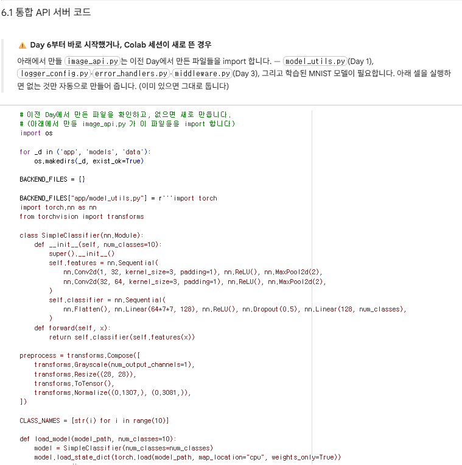  
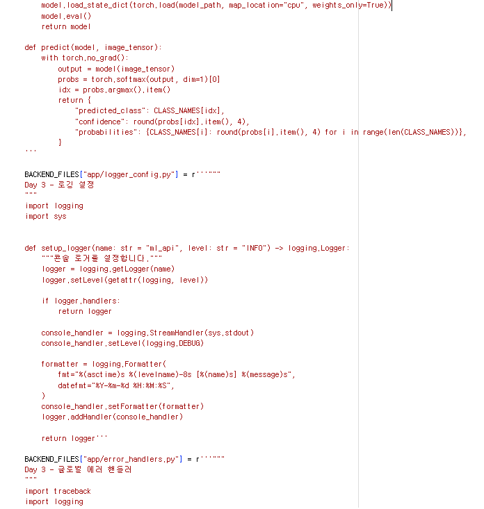  
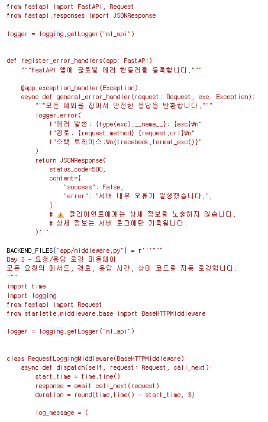  
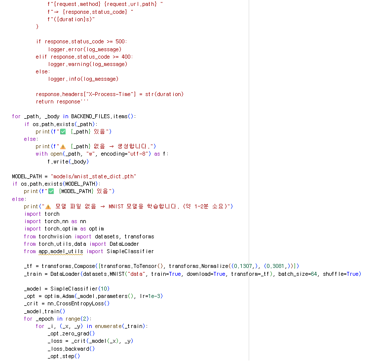  
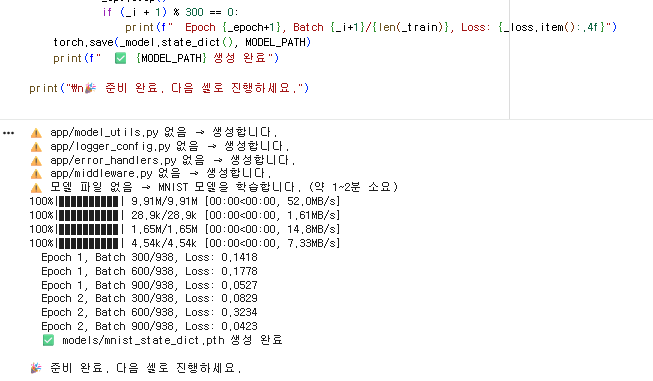  
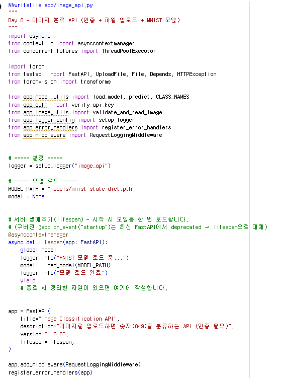  
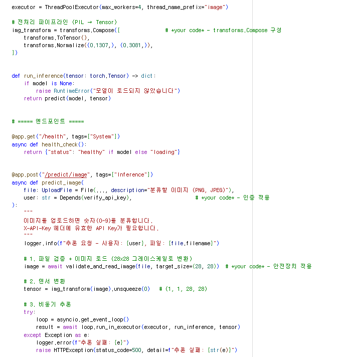  
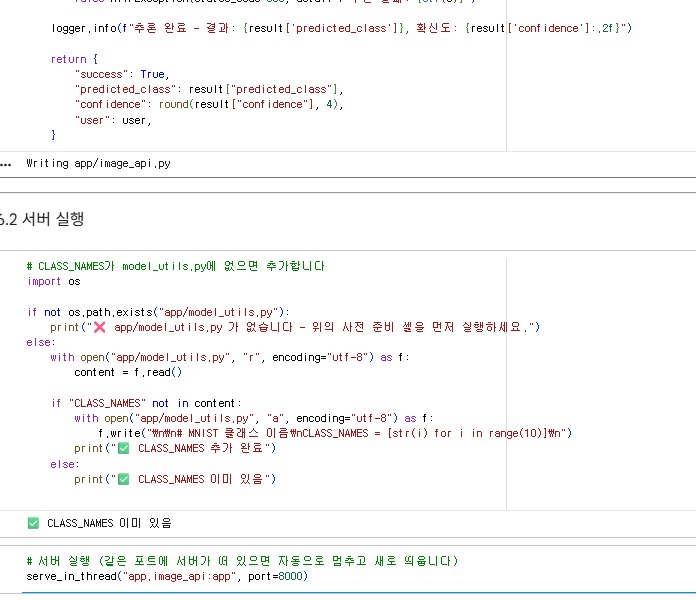  
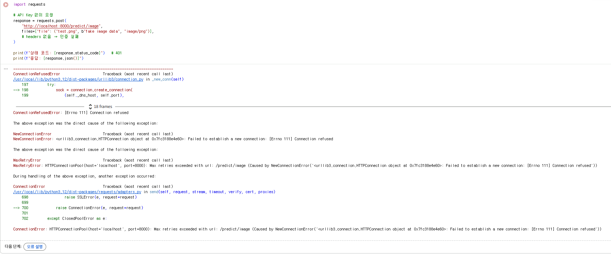  
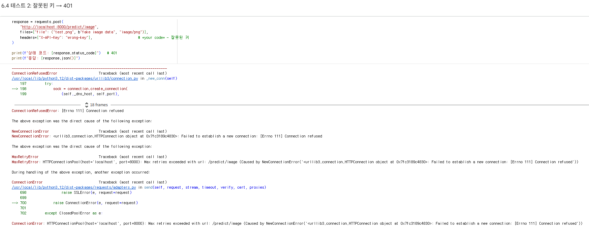  
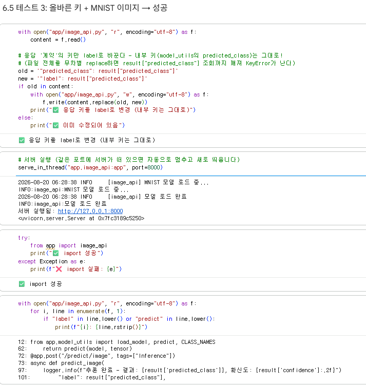  
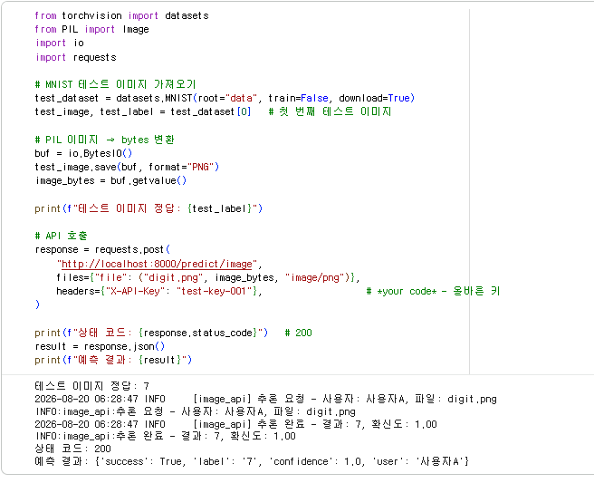  
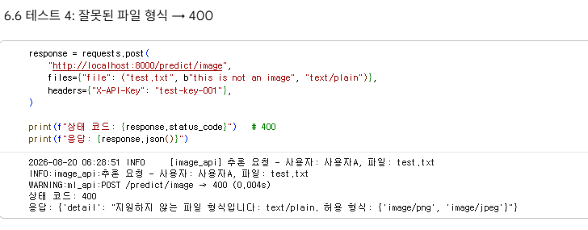  
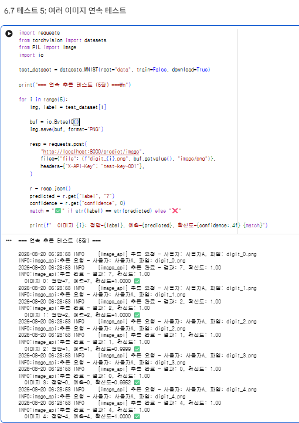  
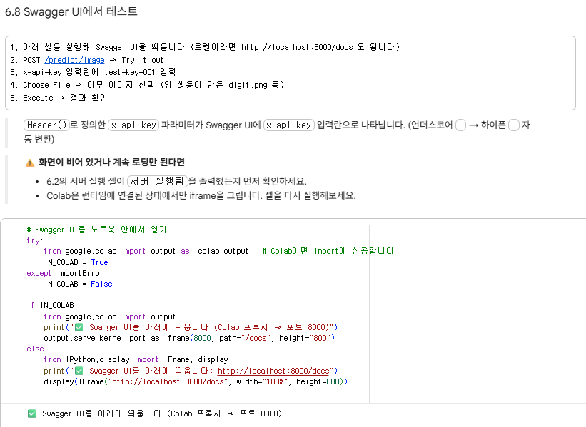  
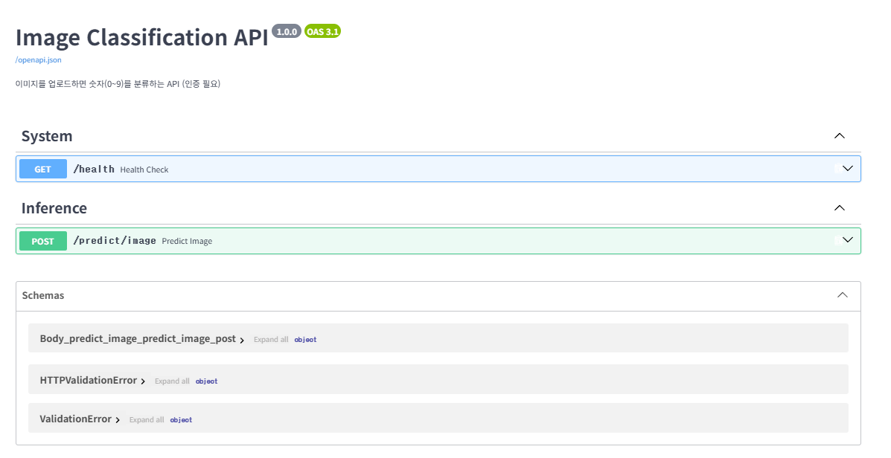  
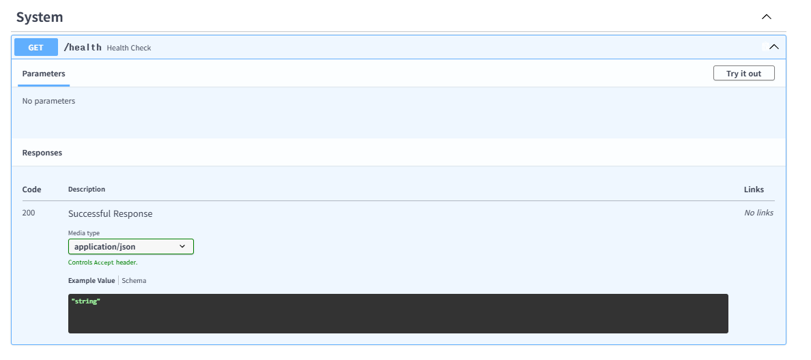  
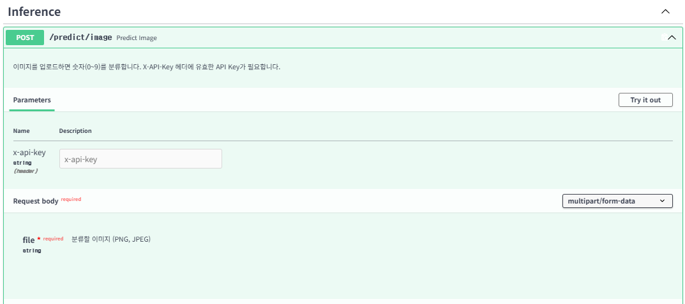  
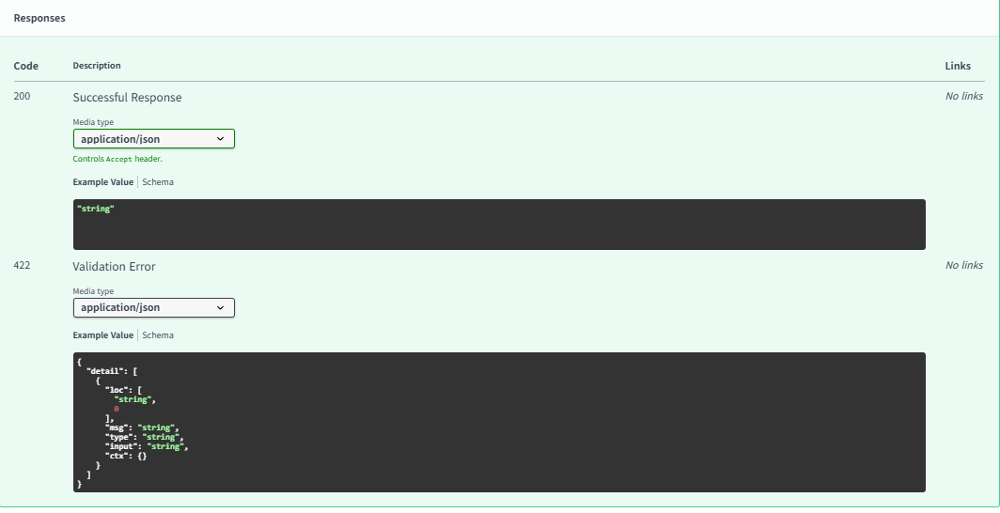  

# 각 섹션 체크포인트의 답변  
## 섹션1 체크포인트  
1. 인증 없는 API가 위험한 이유를 두 가지 이상 설명하세요.  
인증 없는 API는 누구나 호출할 수 있어 비용·서버 자원이 소모되고,  
악의적인 대량 요청으로 서비스 장애가 날 수 있습니다.  
또한 모델·데이터가 무단 사용되거나 API가 남용될 위험이 있습니다.  

2. API Key 방식이 ML 추론 API에 적합한 이유는 무엇입니까?  
API Key는 요청 헤더에 간단히 포함해 서버가 호출자를 식별·검증할 수 있으므로,  
서버 간 ML 추론 API에 구현과 사용이 간편합니다. 키별 사용량 관리·차단도 가능합니다.

## 섹션2 체크포인트  
1. Header(None)에서 None은 어떤 상황에서 x_api_key에 들어갑니까?  
요청 헤더에 X-API-Key가 없을 때 Header(None)의 None이 x_api_key에 들어갑니다.  

2. Depends(verify_api_key)를 엔드포인트에 추가하면 요청 처리 흐름이 어떻게 바뀝니까?  
Depends(verify_api_key)를 추가하면 FastAPI가 엔드포인트 함수를 실행하기 전에 verify_api_key를 먼저 실행합니다.  
인증 성공 시 반환값이 user에 전달되고, 실패 시 엔드포인트는 실행되지 않으며 401 응답을 반환합니다.  

3. 인증 실패 시 반환하는 HTTP 상태 코드 401의 의미는 무엇입니까?  
HTTP 401은 “인증되지 않음(Unauthorized)”을 뜻합니다. 유효한 인증 정보가 없거나 잘못되었음을 의미합니다.

## 섹션4 체크포인트  
1. UploadFile과 Base64 방식의 핵심 차이는 무엇입니까?  
UploadFile은 파일을 multipart/form-data로 직접 전송·처리하는 방식이고,  
Base64는 파일 데이터를 문자열로 인코딩해 JSON 등에 넣는 방식입니다.  
UploadFile은 인코딩/디코딩 과정이 없고 데이터 크기 증가도 적어 파일 업로드에 더 편리합니다.  

2. file.content_type으로 타입을 검증하는 이유는 무엇입니까?  
file.content_type으로 MIME 타입을 확인해 이미지가 아닌 파일을 1차로 걸러내기 위해서입니다.  
다만 클라이언트가 위조할 수 있으므로 실제 이미지 디코딩 검증도 함께 해야 합니다.  

3. 파일 크기를 제한하지 않으면 어떤 문제가 발생할 수 있습니까?  
큰 파일을 무제한 업로드하면 메모리·디스크·네트워크 자원이 소모되고, 서버가 느려지거나 장애가 날 수 있습니다.  
악의적 대용량 요청에 의한 서비스 거부 공격 위험도 커집니다.  

## 섹션6 최종 체크포인트  
Q1. API Key 인증이 없으면 어떤 위험이 있습니까? (두 가지 이상)  
API Key가 없으면 무단 사용, 비용 증가, 서버 자원 고갈, 대량 요청에 따른 서비스 장애 등이 발생할 수 있습니다.  

Q2. Depends(verify_api_key)는 엔드포인트 실행 전에 어떤 일을 합니까?  
Depends(verify_api_key)는 요청의 API Key를 검사합니다.  
성공하면 엔드포인트를 계속 실행하고 사용자 정보를 전달하며,  
실패하면 실행을 중단하고 401을 반환합니다.  

Q3. UploadFile 방식이 Base64보다 편리한 점은 무엇입니까?  
UploadFile은 파일을 직접 전송하므로 Base64 인코딩·디코딩이 필요 없고, 데이터 크기 증가가 없어 더 효율적입니다.  

Q4. 파일 업로드 시 크기 제한을 하지 않으면 어떤 문제가 생깁니까?  
파일 크기 제한이 없으면 대용량 파일이 서버 자원을 점유해 속도 저하, 메모리·디스크 부족, 서비스 장애가 발생할 수 있습니다.  

Q5. 이미지를 28x28 그레이스케일로 변환하는 이유는 무엇입니까?  
MNIST 모델이 학습된 입력 형식이 1채널(그레이스케일) 28×28 이미지이기 때문입니다.  
입력 크기와 채널을 맞춰야 모델이 정상적으로 추론할 수 있습니다.  