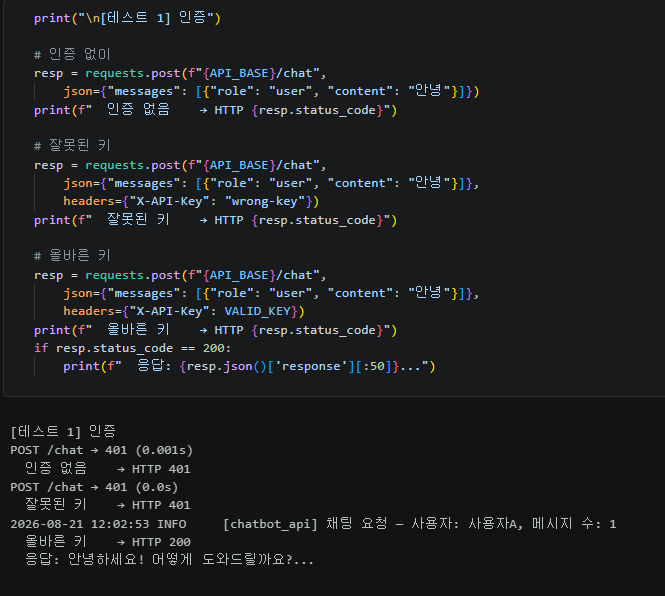
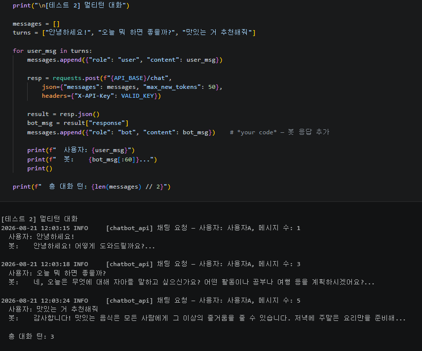
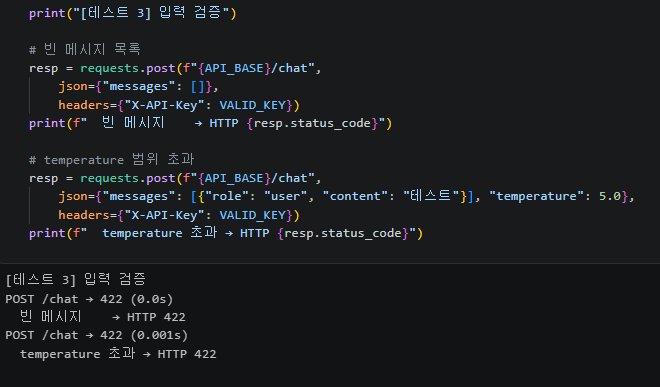
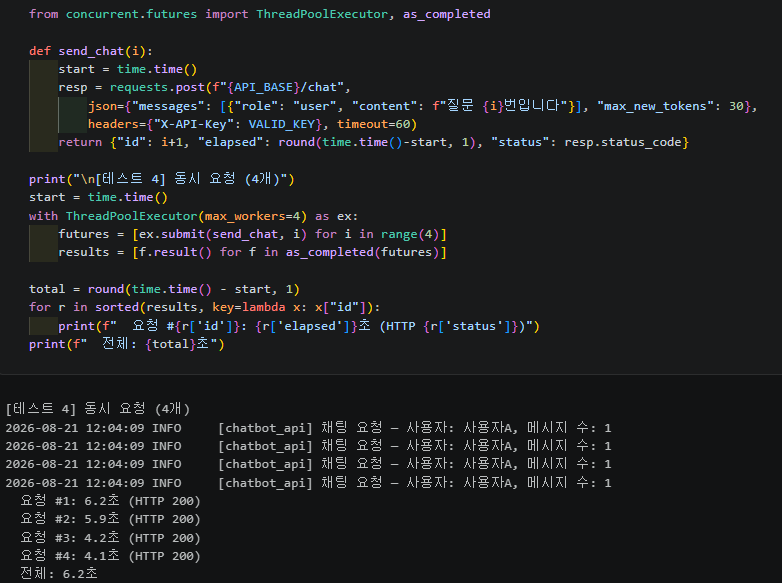
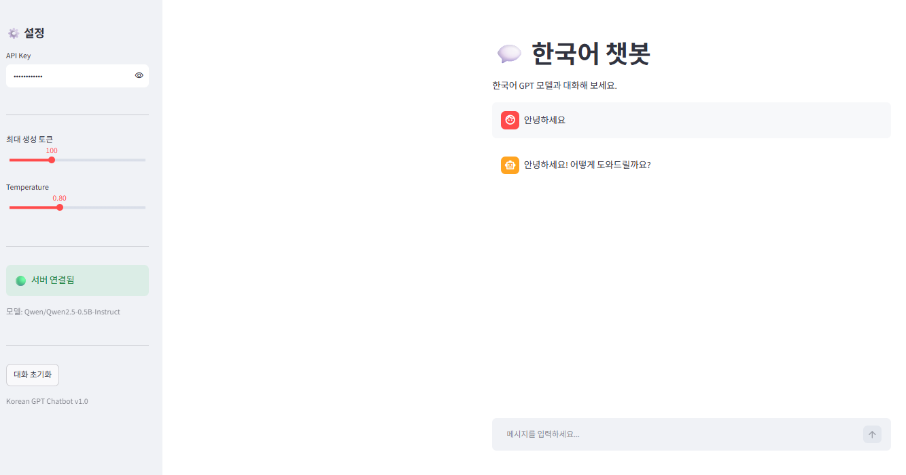
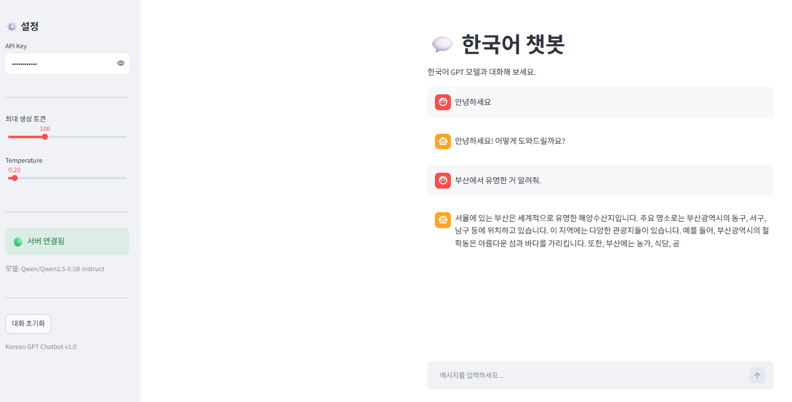
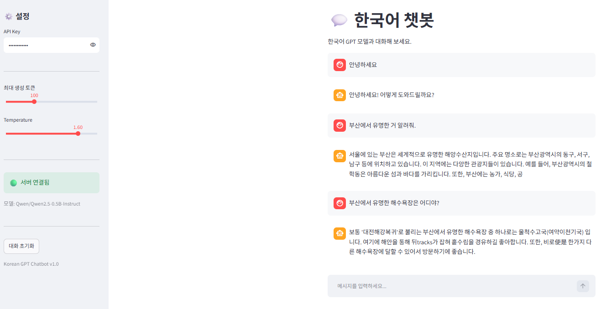
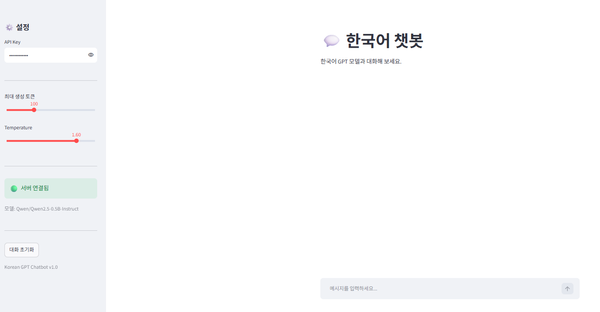
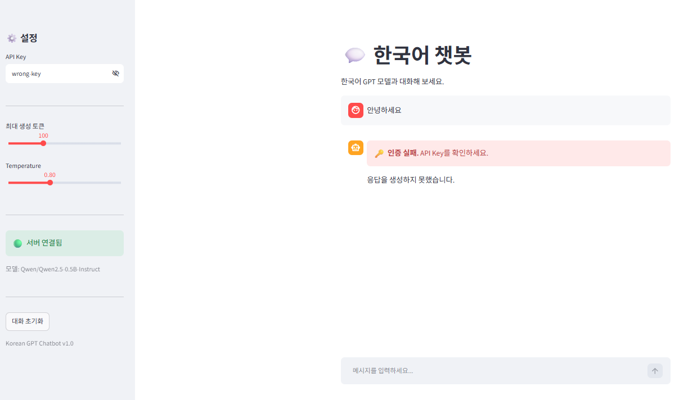

# 모델배포 07  

## 섹션06  

### 테스트 1: 인증  
  

### 테스트 2: 멀티턴 대화
  

### 테스트 3: 입력 검증  
  

### 테스트 4: 동시 요청  
  

## UI 테스트 1~4 실행 결과  

### 테스트 1 UI  
  

### 테스트 2 UI  
  
  

### 테스트 3 UI  
  

### 테스트 4 UI  
  

## 각 섹션 체크포인트  
### 섹션1  

1. Day 5(정형 데이터)와 Day 7(텍스트 생성)에서 전처리가 어떻게 다릅니까?  
Day 5에서는 숫자형 정형 데이터를 모델 입력에 맞게 평균과 표준편차를 이용해 정규화했습니다.  
반면 Day 7에서는 문장을 토크나이저로 분할하고, 각 토큰을 모델이 처리할 수 있는 토큰 ID로 변환합니다.  

2. Hugging Face Transformers 라이브러리의 역할은 무엇입니까?  
Hugging Face Transformers는 사전 학습된 언어 모델과 토크나이저를 쉽게 내려받아 로드하고,  
토큰화·추론·텍스트 생성을 수행할 수 있게 해 주는 라이브러리입니다.

### 섹션2  
1. 토크나이저의 `encode()`와 `decode()`는 각각 어떤 변환을 수행합니까?  
`encode()`는 사람이 읽는 텍스트를 모델 입력용 토큰 ID로 변환하고,  
`decode()`는 토큰 ID를 다시 사람이 읽을 수 있는 텍스트로 변환합니다.  

2. `model.generate()`의 `temperature` 파라미터는 생성 결과에 어떤 영향을 줍니까?  
`temperature`는 다음 토큰을 선택할 때의 무작위성(다양성)을 조절합니다.  
값이 낮으면 확률이 높은 토큰을 더 우선해 일관되고 보수적인 답변이 나오며,  
값이 높으면 더 다양한 표현이 나오지만 부정확하거나 산만해질 수 있습니다.  

3. 멀티턴 대화에서 이전 대화 기록을 프롬프트에 포함하는 이유는 무엇입니까?  
이전 대화 기록을 포함해야 모델이 앞선 질문·답변의 맥락,  
사용자의 의도와 지시를 이해하여 자연스럽고 일관된 다음 응답을 생성할 수 있습니다.

### 섹션3  
1. `ChatRequest`의 `messages`가 리스트인 이유는 무엇입니까?  
`messages`는 한 번의 질문만이 아니라 사용자와 봇이 주고받은 여러 메시지,  
즉 멀티턴 대화 기록을 순서대로 전달해야 하므로 리스트입니다.  

2. 서버가 대화 기록을 저장하지 않고, 클라이언트가 매번 전체 기록을 보내는 이유는?  
서버를 무상태(Stateless)로 유지하면 특정 서버 메모리에 세션이 묶이지 않아 구현과 확장이 단순해집니다.  
따라서 클라이언트가 대화 기록을 관리하고 요청마다 전체 기록을 보내면 어느 서버가 처리해도 같은 맥락을 재구성할 수 있습니다.  

3. `max_new_tokens`을 너무 크게 설정하면 어떤 문제가 발생할 수 있습니까?  
`max_new_tokens`가 너무 크면 응답 생성 시간이 길어지고 CPU·GPU 메모리와 연산 자원을 많이 사용합니다.  
불필요하게 긴 답변, 요청 지연·타임아웃, 동시 처리량 저하도 발생할 수 있습니다.

### 섹션4  
1. `st.chat_message`와 `st.chat_input`은 각각 어떤 역할을 합니까?  
`st.chat_message`는 사용자 또는 어시스턴트의 말풍선 영역을 만들어 메시지를 표시하고,  
`st.chat_input`은 사용자가 채팅 메시지를 입력해 전송하는 입력창을 제공합니다.  

2. `st.session_state["chat_messages"]`에 대화 기록을 저장하는 이유는?  
Streamlit은 상호작용할 때마다 스크립트를 위에서부터 다시 실행하므로,  
`st.session_state["chat_messages"]`에 기록을 저장해야 이전 대화가 사라지지 않고 화면 표시 및 API 요청에 계속 활용됩니다.

3. "대화 초기화" 버튼이 `st.rerun()`을 호출하는 이유는 무엇입니까?  
기록을 비운 뒤 `st.rerun()`을 호출하면 앱 스크립트를 즉시 다시 실행해, 초기화된 대화 화면이 곧바로 반영됩니다.

### 섹션5  
1. 챗봇 API에서 인증이 실패하면 서버는 어떤 상태 코드를 반환합니까?  
API Key가 없거나 잘못되면 서버는 **401 Unauthorized** 상태 코드를 반환합니다.  

2. UI의 `call_chat_api()`는 401 응답을 받으면 사용자에게 무엇을 보여줍니까?  
`call_chat_api()`는 401 응답을 받으면 사용자에게 “🔑 인증 실패. API Key를 확인하세요.”라는 오류 메시지를 표시합니다.  

3. Day 6의 인증 모듈(`app/auth.py`)을 Day 7에서 수정 없이 재사용할 수 있는 이유는 무엇입니까?  
인증은 HTTP 헤더의 `X-API-Key`를 검증하는 API 공통 관심사이며, 요청 본문이 이미지인지 텍스트인지와 독립적입니다.  
따라서 Day 6의 `verify_api_key()` 의존성 함수를 Day 7 API에도 그대로 연결해 재사용할 수 있습니다.  

### Day 7 최종 체크포인트
Q1. Day 5(정형 데이터)와 Day 7(텍스트 생성)에서 전처리 방식의 차이는?  
Day 5는 숫자형 정형 데이터를 평균·표준편차로 정규화해 입력했고,  
Day 7은 텍스트를 토크나이저로 토큰화하여 토큰 ID로 변환해 입력했습니다.  

Q2. 멀티턴 대화에서 서버가 상태를 유지하지 않는 이유는?  
서버를 무상태로 유지하면 확장과 운영이 단순해지고,  
어떤 서버가 요청을 처리해도 클라이언트가 보낸 기록만으로 대화 맥락을 재구성할 수 있기 때문입니다.  

Q3. API Key가 잘못되면 서버는 어떤 상태 코드를 반환하고, UI는 어떻게 처리합니까?  
서버는 **401 Unauthorized**를 반환합니다.  
UI는 이를 받아 “🔑 인증 실패. API Key를 확인하세요.”라고 안내합니다.  

Q4. temperature를 낮추면 생성 결과에 어떤 변화가 있습니까?  
temperature를 낮추면 높은 확률의 토큰을 더 우선 선택하므로 답변이 더 일관되고 보수적으로 변합니다.  
반대로 표현의 다양성은 줄어듭니다.  

Q5. 이 서비스를 다른 컴퓨터에서 실행하려면 무엇이 필요합니까?  
Python 실행 환경과 필요한 패키지(PyTorch, Transformers, FastAPI, Uvicorn, Streamlit, Requests 등),  
프로젝트 소스 코드와 유효한 API Key 설정이 필요합니다.  
또한 모델을 처음 내려받을 인터넷 연결과 모델 크기에 맞는 저장 공간·메모리, 그리고  
백엔드와 프론트엔드를 실행할 수 있는 포트 환경이 필요합니다.  

### 학습 회고  

오늘 학습을 통해 언어 모델을 단순히 호출하는 데서 그치지 않고,  
실제 서비스 형태로 연결하는 전체 흐름을 이해할 수 있었다.  
Hugging Face의 토크나이저와 생성 모델을 사용해 한국어 응답을 만들고,  
이전 대화 기록을 함께 전달해 멀티턴 대화의 맥락을 유지하는 과정이 특히 중요하게 느껴졌다.  
또한 FastAPI로 추론 기능을 API로 분리하고, Streamlit으로 사용자가 바로 대화할 수 있는 화면을 구성하면서  
백엔드와 프론트엔드의 역할도 명확히 구분할 수 있었다.  

API Key 인증과 입력 검증, 오류 처리까지 적용해 보며 모델 성능뿐 아니라,  
서비스의 안전성과 사용성도 함께 고려해야 한다는 점을 배웠다.  
`temperature`와 `max_new_tokens`처럼 생성 품질과 자원 사용량에 영향을 주는 설정값의 균형도 생각해 볼 수 있었다.  
앞으로는 긴 대화에서 컨텍스트를 더 효율적으로 관리하는 방법과,  
실제 환경에서는 API Key를 환경 변수나 시크릿 매니저로 안전하게 관리하는 방법을 추가로 학습해 보고 싶다.  

